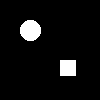

# VLM Agent Synth: Program-Guided Image Editing via GPT-4V

This project implements a vision-language model (VLM) agent that **iteratively edits a structured program** to match a **target image**, using **GPT-4V** with ReAct/Reflexion-style reasoning. The system performs a beam search over program edits, guided by visual feedback (IoU and diff images).

## 🔧 Project Structure

```text
agent-synth/
    ├── main.py           # Orchestrates the full editing pipeline
    ├── render_engine.py  # Renders a program into an image
    ├── tree_editor.py    # Parses and applies program edits
    ├── vlm_agent.py      # VLM (GPT-4V) interface with Reflexion-style feedback
    ├── utils.py          # IoU computation and image utilities
    ├── outputs/          # Logs, images, and results from each beam step
    └── data/             # (Optional) GT or input programs/images
```

## 🧠 Pipeline Overview

1. **Initialize**

    - Define a *ground truth program* and an *initial (noisy) program*.
    - Render both into images using `render_program`.
    - Compute initial IoU as similarity signal.

    **Ground truth program:**
    ```json
    {
      "type": "Add",
      "children": [
        {"type": "Circle", "x": 30, "y": 30, "r": 10},
        {"type": "Square", "x": 60, "y": 60, "size": 15}
      ]
    }
    ```
    

    **Initial (noisy) program:**
    ```json
    {
      "type": "Add",
      "children": [
        {"type": "Circle", "x": 40, "y": 40, "r": 5}
      ]
    }
    ```
    

2. **Beam Search with Reflexion**
   - At each step, GPT-4V observes:
     - Current image
     - Target image
     - IoU improvement trend
     - Difference crop between current and target image
     - Program code
   - GPT-4V then:
     - Provides a **thought** explaining the visual gap.
     - Outputs a single **JSON edit** (insert, modify, delete, or replace).
   - The edit is applied using `apply_edit`, and the new IoU is computed.
   **PS:** In this simplified situation, there are only cube and circle existed in the scene and insert_child action given by edit can only choose from cube and circle

3. **Search Strategy**
   - Beam width = 15; max steps = 20
   - After each step, top candidates are retained by IoU ranking.
   - Stops when a candidate achieves IoU > 0.95.

4. **Logging**
   - For each step:
     - Saves candidate image, program JSON, IoU, and last edit.
   - Final visual comparison saved:
     - `final_image.png`
     - `final_diff.png`

5. **Result**
   - Final result is saved to `outputs/final_result.json` including:
     - Best IoU
     - Step number
     - Reconstructed program

## 🖼 Example Edit Format

```json
{
  "action": "insert_child",
  "target_path": [],
  "new_node": {
    "type": "Square",
    "x": 50,
    "y": 50,
    "size": 20
  }
}
```

## 🧩 Supported Edit Actions

- `"insert_child"`: Add a new node under a subtree  
- `"modify_param"`: Change a node's attribute  
- `"replace"`: Replace a node with a new one  
- `"delete"`: Remove a node from children list  

## 🧠 GPT-4V Thought + Reflexion

The `call_vlm_agent_with_reflexion` method enables richer reasoning:

- Tracks IoU trend (improvement or stagnation)  
- Highlights difference crop  
- Injects a structured prompt with program context and visual evidence  
- Expects a `Thought:` and a structured `JSON` edit  

## 💡 Dependencies

- Python 3.8+  
- `openai`  
- `Pillow`  
- `matplotlib`  

Make sure to set your OpenAI API key:

```bash
export OPENAI_API_KEY="your-api-key-here"
```

## 🚀 Run

```bash
python main.py
```
